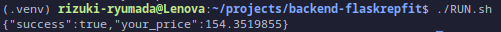

# Simple Repfit ML Deploy
This is a simple ML Deployment using flask microframework.

## Getting Started

### 1. Create a Virtual Environment (venv)
Create a virtual environment to install the packages inside `requirement.txt` file. Please refer to this link to see how to make it: https://gist.github.com/ryumada/c22133988fd1c22a66e4ed1b23eca233

### 2. Install the Required Packages
Don't forget to activate the virtual environment first before running this command.

```bash
pip install -r requirement.txt
```
> This will take a while because of the large size of tensorflow package (5xxMB).

### 3. Run the server
This command will activate flask's development server.

```bash
flask run
```

### 4. Test the server
Here I have prepared a shell script file called `RUN.sh` to test if the server running properly.

You need to add execute permission to this file before you can run it.

```bash
chmod +x RUN.sh
```

Then, you can execute the file.

```bash
./RUN.sh
```

The server is working properly if showing the result like this:

  
